# Software Architecture Document
## AI-Powered Options Trading Research Platform — Indian Markets (NSE/BSE)

**Version**: 2.0 | **Date**: 2026-06-30 | **Classification**: Personal Research Tool

### Key Decisions vs v1.0
- Personal use → true monolith, Docker Compose on Mac Mini
- Mac Mini (owned) → $0 compute cost
- Kafka removed → Redis pub/sub
- ClickHouse removed → TimescaleDB handles personal-scale backtesting
- K8s/EKS removed → Docker Compose
- Kong removed → nginx
- RDS/ElastiCache removed → local PostgreSQL + Redis in Docker
- LLM split: Claude Sonnet (strategy + eval), Claude Haiku (risk), Groq free (research + monitor), Ollama (local backup)
- Access: Cloudflare Tunnel (free, no port forwarding)
- Frontend: Vercel free tier

---

## 1. High-Level Architecture

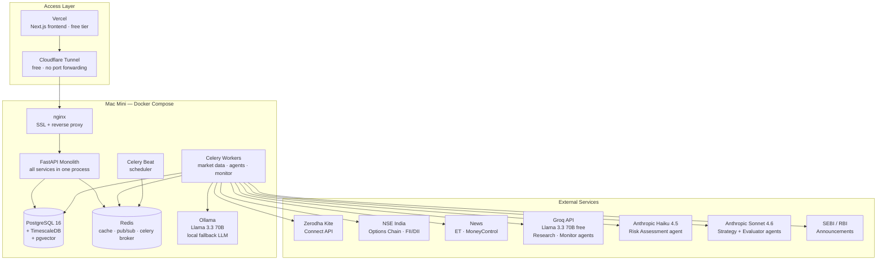

**Monthly cost: ₹2,700 (Kite ₹2,000 + Claude API ₹500 + electricity ₹200)**

---

## 2. Service Architecture

### Monolith Module Decomposition

Single FastAPI process. Modules are Python packages, not separate services.

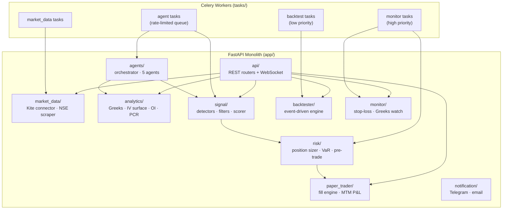

### Communication Within Monolith

- Module-to-module: direct Python function calls
- Async work: Celery tasks via Redis
- Real-time push to dashboard: Redis pub/sub → WebSocket

No HTTP between internal modules. No Kafka.

---

## 3. Folder Structure

```
options-research-platform/
├── app/
│   ├── api/
│   │   ├── routers/           # FastAPI routers per domain
│   │   ├── schemas/           # Pydantic request/response schemas
│   │   ├── websocket/         # WS handlers (ticks, P&L, alerts)
│   │   └── main.py            # FastAPI app init + router registration
│   ├── market_data/
│   │   ├── kite.py            # Kite Connect WebSocket + REST
│   │   ├── nse.py             # NSE options chain scraper
│   │   ├── news.py            # ET / MoneyControl scraper
│   │   └── normalizer.py      # Unified tick/chain schema
│   ├── analytics/
│   │   ├── greeks.py          # py_vollib Greeks computation
│   │   ├── iv_surface.py      # Vol surface construction
│   │   ├── oi_analysis.py     # OI, PCR, max pain
│   │   └── chain.py           # Options chain processor
│   ├── agents/
│   │   ├── orchestrator.py    # Agent run coordinator
│   │   ├── market_research.py # Groq Llama — news + FII synthesis
│   │   ├── strategy.py        # Claude Sonnet — strike/strategy selection
│   │   ├── risk_assessment.py # Claude Haiku — pre-trade risk check
│   │   ├── monitor.py         # Groq Llama — position health
│   │   ├── evaluator.py       # Claude Sonnet — self-improvement
│   │   ├── tools.py           # Tool definitions (Anthropic + OpenAI format)
│   │   ├── memory.py          # pgvector RAG interface
│   │   └── prompts/           # System prompts per agent
│   ├── signal/
│   │   ├── detectors/         # Pattern detectors per strategy
│   │   ├── filters.py         # Liquidity + statistical filters
│   │   └── scorer.py          # Composite signal score
│   ├── risk/
│   │   ├── sizer.py           # Kelly + fixed-fraction sizing
│   │   ├── var.py             # Historical simulation VaR
│   │   └── gates.py           # Pre-trade check layers
│   ├── paper_trader/
│   │   ├── fill_engine.py     # Slippage model + fill simulation
│   │   ├── portfolio.py       # Holdings + cash + MTM
│   │   └── pnl.py             # Greeks-decomposed P&L
│   ├── backtester/
│   │   ├── engine.py          # Event-driven backtest loop
│   │   ├── clock.py           # Simulation clock (injectable)
│   │   ├── broker.py          # Historical fill simulator
│   │   ├── strategies/        # BaseStrategy + implementations
│   │   └── metrics.py         # Sharpe, Sortino, drawdown, win-rate
│   ├── monitor/
│   │   ├── watcher.py         # Stop-loss + expiry proximity
│   │   └── greeks_live.py     # Real-time portfolio Greeks
│   ├── notification/
│   │   ├── telegram.py
│   │   └── email.py
│   └── core/
│       ├── config.py          # pydantic-settings from .env
│       ├── db.py              # SQLAlchemy async engine
│       ├── redis.py           # Redis client singleton
│       ├── calendar.py        # NSE market calendar + hours check
│       └── constants.py       # NSE lot sizes, expiry rules
├── tasks/
│   ├── market_data.py         # Celery tasks: chain refresh, tick ingest
│   ├── agents.py              # Celery tasks: daily research cycle
│   ├── monitor.py             # Celery tasks: stop-loss, Greeks refresh
│   └── backtest.py            # Celery tasks: async backtest run
├── models/                    # SQLAlchemy ORM models
├── migrations/                # Alembic migrations
├── frontend/                  # Next.js app (deployed to Vercel)
│   ├── src/
│   │   ├── app/               # App Router pages
│   │   ├── components/
│   │   │   ├── charts/        # TradingView, payoff, IV surface
│   │   │   ├── options-chain/
│   │   │   └── positions/
│   │   ├── hooks/
│   │   ├── stores/            # Zustand
│   │   └── lib/               # API + WebSocket client
│   └── public/
├── scripts/
│   ├── backfill.py            # Historical OHLCV + chain backfill
│   └── market_calendar.py     # Sync NSE holiday calendar
├── docker-compose.yml         # 6 containers (see Section 19)
├── nginx/
│   └── nginx.conf
├── .env                       # secrets (local only, never committed)
└── .github/workflows/         # CI: lint + test only
```

---

## 4. Database Design

### Single Store: PostgreSQL 16 + TimescaleDB + pgvector

No ClickHouse. TimescaleDB with compression handles personal-scale backtesting. pgvector handles embeddings. One DB, one connection pool.

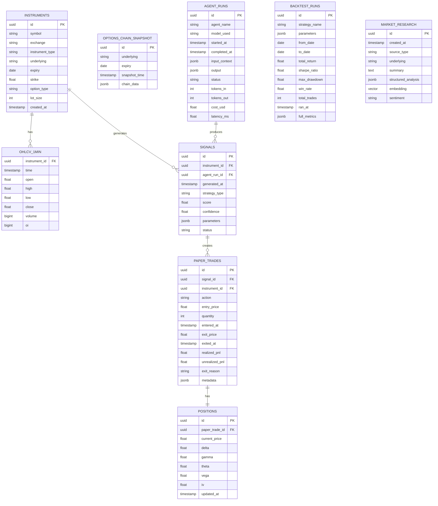

### TimescaleDB Config

```
OHLCV_1MIN             → hypertable, chunk_interval=1day, retention=5years
OPTIONS_CHAIN_SNAPSHOT → hypertable, chunk_interval=4hours, retention=2years
```

Compression after 7 days. For personal watchlist (~30 instruments):
- OHLCV: ~2.8M rows/year → compressed ~30MB/year (trivial)
- Chain snapshots: ~12,500/year → ~6GB/year uncompressed, ~600MB compressed

No ClickHouse needed at this scale.

### Redis Key Patterns

| Key | TTL | Purpose |
|-----|-----|---------|
| `market:tick:{symbol}` | 5s | Latest tick |
| `options:chain:{underlying}:{expiry}` | 30s | Chain cache |
| `signal:pending:{id}` | 1hr | Unprocessed signal |
| `position:pnl:{trade_id}` | 60s | Live MTM |
| `agent:context:{run_id}` | 2hr | Agent working memory |
| `ratelimit:kite:{endpoint}` | 1s | API rate bucket |
| `job:lock:{job_name}` | job_timeout | Duplicate job prevention |
| `pubsub:tick:{symbol}` | — | WebSocket broadcast channel |
| `pubsub:pnl` | — | P&L broadcast channel |
| `pubsub:signal:new` | — | Signal notification channel |

---

## 5. Monolith Decision

**Decision: True Monolith. No microservices.**

Personal app. One user. One Mac Mini. Complexity of microservices = pure overhead with zero benefit.

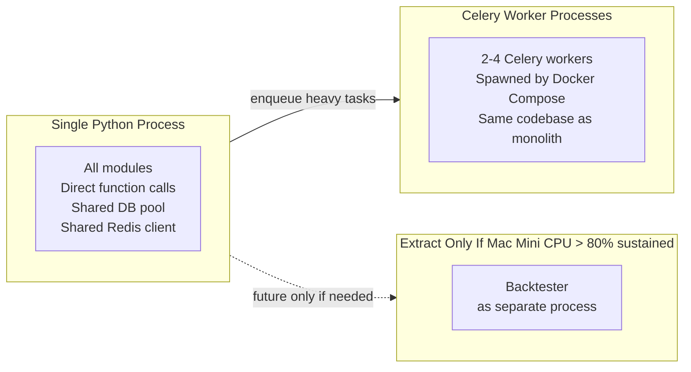

Internal module calls are function calls, not HTTP. Zero serialization overhead. Shared SQLAlchemy session pool. No service discovery needed.

---

## 6. API Architecture

### Design

- REST for all resource endpoints
- WebSocket for real-time ticks, P&L, alerts
- nginx handles SSL termination + static file serving
- No API gateway, no rate limiting beyond nginx basic limits

### Endpoint Inventory

```
Auth
  POST   /api/v1/auth/login
  POST   /api/v1/auth/refresh
  POST   /api/v1/auth/logout

Market Data
  GET    /api/v1/market/instruments
  GET    /api/v1/market/quote/{symbol}
  GET    /api/v1/market/ohlcv/{symbol}?interval=1m&from=&to=
  GET    /api/v1/market/options-chain/{underlying}/{expiry}
  WS     /ws/market/ticks/{symbol}

Analytics
  GET    /api/v1/analytics/iv-surface/{underlying}
  GET    /api/v1/analytics/greeks/{instrument_id}
  GET    /api/v1/analytics/oi-analysis/{underlying}
  GET    /api/v1/analytics/pcr/{underlying}
  GET    /api/v1/analytics/max-pain/{underlying}/{expiry}

AI Research
  POST   /api/v1/research/trigger
  GET    /api/v1/research/runs
  GET    /api/v1/research/runs/{run_id}
  GET    /api/v1/research/insights/{underlying}

Signals
  GET    /api/v1/signals
  GET    /api/v1/signals/{id}
  POST   /api/v1/signals/{id}/approve
  POST   /api/v1/signals/{id}/reject

Paper Trading
  GET    /api/v1/paper/portfolio
  GET    /api/v1/paper/trades
  GET    /api/v1/paper/trades/{id}
  POST   /api/v1/paper/trades/{signal_id}/execute
  POST   /api/v1/paper/trades/{id}/close
  WS     /ws/paper/pnl

Backtesting
  POST   /api/v1/backtest/run
  GET    /api/v1/backtest/runs
  GET    /api/v1/backtest/runs/{id}
  GET    /api/v1/backtest/runs/{id}/trades

Positions
  GET    /api/v1/positions
  GET    /api/v1/positions/{id}
  WS     /ws/positions/alerts
```

### nginx Config Role

```
HTTPS termination (Let's Encrypt via Certbot)
Proxy /api/ and /ws/ → FastAPI :8000
Serve /static/ → local files
Cloudflare Tunnel connects here
```

---

## 7. Authentication Architecture

Single user app. Simple JWT middleware in FastAPI. No separate auth service.

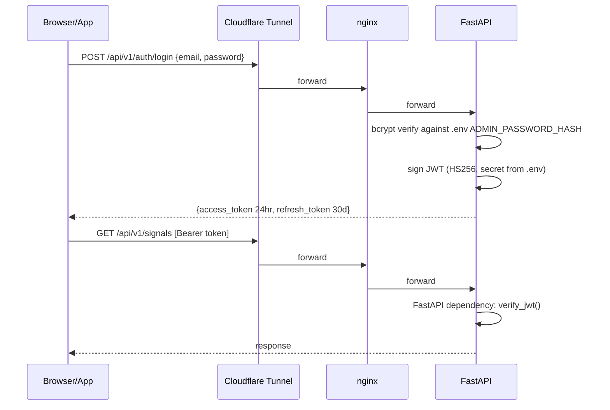

**Design choices:**
- HS256 (symmetric): simpler, single server, no key distribution needed
- Access token 24hr TTL: longer than enterprise because personal use, no session risk
- Refresh token 30d in Redis: revocable on logout
- Password: single admin password hash stored in `.env`
- No OAuth, no user management, no RBAC: one user

---

## 8. Background Jobs

| Job | Trigger | Schedule | Celery Queue |
|-----|---------|----------|--------------|
| Options chain refresh | Scheduled | Every 3 min, market hours | market |
| Historical tick backfill | Manual | On demand | market |
| FII/DII data fetch | Scheduled | Daily 18:00 IST | market |
| NSE circular scrape | Scheduled | Daily 07:00 IST | ai |
| Daily market research | Scheduled | Daily 08:30 IST | ai |
| IV surface recompute | On chain update (Redis pub/sub) | Triggered | analytics |
| Signal generation | On analytics update | Triggered | analytics |
| Position Greeks refresh | Scheduled | Every 5 min, market hours | monitor |
| Stop-loss checker | Scheduled | Every 1 min, market hours | monitor |
| Daily P&L reconciliation | Scheduled | 16:00 IST | monitor |
| Signal outcome evaluator | Scheduled | Daily 16:30 IST | ai |
| Expiry rollover detector | Scheduled | Daily 09:00 IST | market |

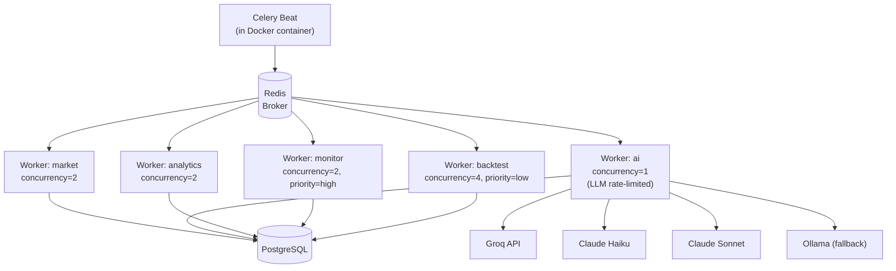

Celery Beat and all workers share same codebase via Docker Compose volumes.

---

## 9. Scheduler Design

### Market-Hours-Aware

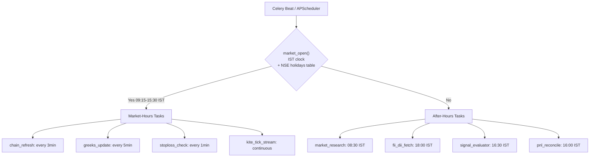

### Mac Mini Wake/Sleep (Power Save)

```bash
# wake at 08:45 IST on weekdays
sudo pmset repeat wakeorpoweron MTWRF 03:15:00  # 08:45 IST = 03:15 UTC

# sleep at 16:15 IST
sudo pmset repeat sleep MTWRF 10:45:00           # 16:15 IST = 10:45 UTC
```

Saves ~18hr/day idle electricity. Mac Mini at load: ~30W → ~10W avg → ₹150/month.

### Distributed Lock (prevent duplicate jobs on restart)

```
Redis SETNX job:lock:{job_name} {pid} EX {max_duration_seconds}
```

---

## 10. Event-Driven Architecture

### Redis Pub/Sub (replaces Kafka)

No Kafka. Redis pub/sub handles all internal events. Sufficient for personal scale (one user, ~30 instruments, low event volume).

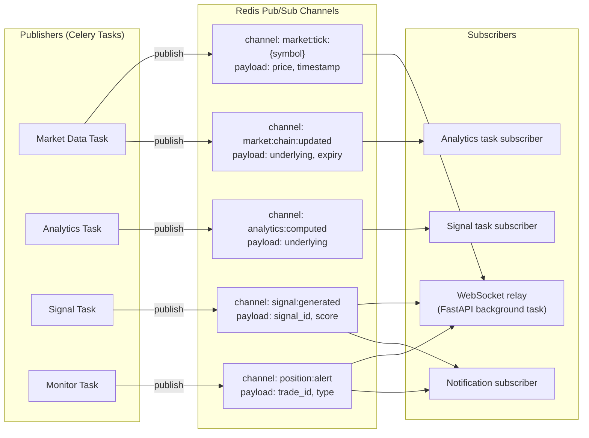

**Trade-off vs Kafka:**
- No message replay (acceptable: DB is source of truth, events are triggers only)
- No consumer group offset management (one subscriber per channel, personal use)
- No durability guarantee (if task missed, Celery Beat re-triggers on next schedule)

---

## 11. AI Agent Architecture

### Model Assignment

| Agent | Model | Provider | Cost | Reason |
|-------|-------|----------|------|--------|
| Market Research | Llama 3.3 70B | Groq (free) | $0 | News synthesis, no complex reasoning |
| **Strategy** | **claude-sonnet-4-6** | Anthropic | ~$0.08/day | Core value — strike selection, strategy design |
| Risk Assessment | claude-haiku-4-5 | Anthropic | ~$0.007/day | Reliable tool use, structured output |
| Monitor | Llama 3.3 70B | Groq (free) | $0 | Simple position check, no deep reasoning |
| **Evaluator** | **claude-sonnet-4-6** | Anthropic | ~$0.11/day | Self-improvement loop, calibration analysis |
| Fallback (all) | Qwen2.5 14B / Llama 3.1 8B | Ollama (local) | $0 | Groq/Anthropic outage |

**Daily total: ~$0.20/day = ₹500/month**

### Agent Architecture

```mermaid
graph TB
    subgraph ORCH ["Orchestrator (orchestrator.py)"]
        O["async task coordinator\nruns via Celery ai queue"]
    end

    subgraph AGENTS ["Agents"]
        MRA["market_research.py\nGroq Llama 3.3 70B"]
        SA["strategy.py\nClaude Sonnet 4.6"]
        RAA["risk_assessment.py\nClaude Haiku 4.5"]
        MON["monitor.py\nGroq Llama 3.3 70B"]
        EVAL["evaluator.py\nClaude Sonnet 4.6"]
    end

    subgraph TOOLS ["tools.py — shared tool definitions"]
        TL1["get_options_chain(underlying, expiry)"]
        TL2["get_ohlcv(symbol, interval, n_bars)"]
        TL3["get_greeks(instrument_id)"]
        TL4["get_oi_analysis(underlying)"]
        TL5["search_news(query, date_range)"]
        TL6["get_fii_dii_data(date)"]
        TL7["get_past_signals(filters)"]
        TL8["get_position_pnl(trade_id)"]
        TL9["get_iv_surface(underlying)"]
    end

    subgraph MEM ["memory.py"]
        STM["Short-term: Redis\nper-run context TTL 2hr"]
        LTM["Long-term: pgvector RAG\nmarket knowledge base"]
        EPI["Episodic: PostgreSQL\nsignal outcomes"]
    end

    subgraph CLIENTS ["LLM Clients (OpenAI-compatible interface)"]
        GROQ_C["Groq client\nbase_url: api.groq.com/openai/v1"]
        ANT_C["Anthropic client\nnative SDK"]
        OLLAMA_C["Ollama client\nbase_url: localhost:11434/v1"]
    end

    O --> MRA & SA & RAA & MON & EVAL

    MRA --> TL5 & TL6 & TL2
    SA --> TL1 & TL3 & TL4 & TL9
    RAA --> TL3 & TL2
    MON --> TL8 & TL2
    EVAL --> TL7 & TL8

    MRA --> GROQ_C
    MON --> GROQ_C
    SA --> ANT_C
    EVAL --> ANT_C
    RAA --> ANT_C

    GROQ_C -.->|"outage fallback"| OLLAMA_C
    ANT_C -.->|"outage fallback"| OLLAMA_C

    MRA <--> STM
    SA <--> STM
    MRA <--> LTM
    EVAL <--> EPI
```

### Daily Research Cycle

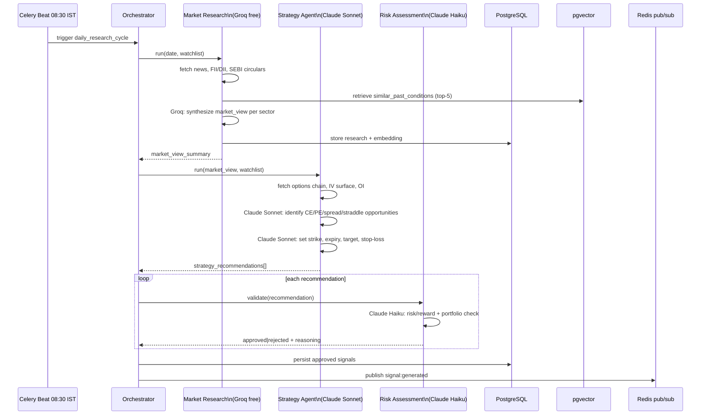

### Evaluator Agent (Self-Improvement Loop)

Runs daily 16:30 IST.

**Inputs:** Past 30 days signals + price outcomes + paper trade P&L + Greeks at entry/exit

**Outputs:**
- Win/loss by strategy type + market regime
- Confidence calibration score
- Prompt performance notes → stored to DB → retrieved by RAG in next research cycle
- Adjusts `confidence_multiplier` per strategy type in DB

---

## 12. Risk Management Architecture

### Risk Layers

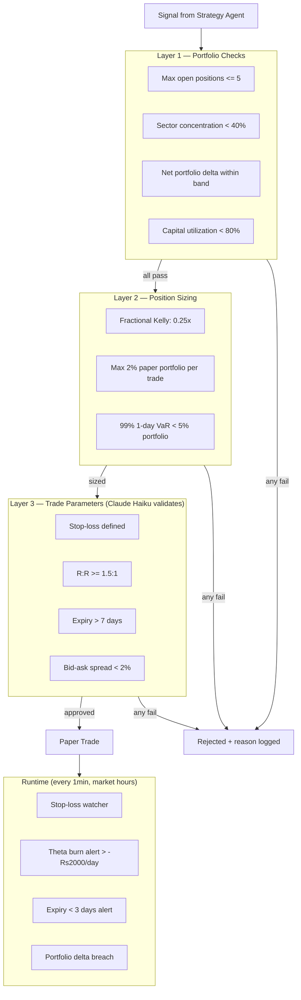

### Risk Metrics

| Metric | Alert Threshold |
|--------|----------------|
| Portfolio Delta | net > Rs50,000 |
| Portfolio Vega | net > Rs10,000 |
| Daily Theta Burn | < -Rs2,000/day |
| Max Drawdown | > 15% |
| Win Rate (30d) | < 40% triggers evaluator |
| VaR 99% 1-day | > 5% portfolio |

---

## 13. Paper Trading Architecture

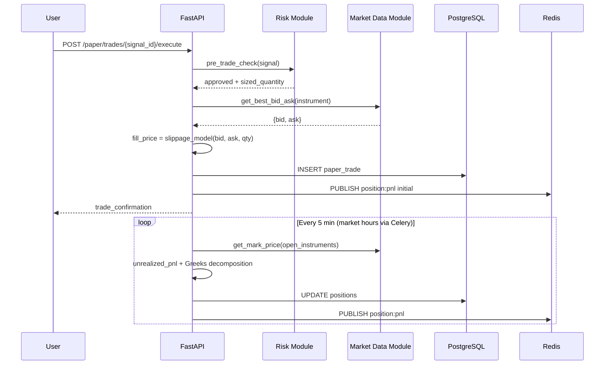

### Slippage Model

```
Liquid   (OI > 1,000, spread < 1%):   fill = mid + 0.5 × spread
Semi-liq (OI 200–1,000, spread 1-2%): fill = ask
Illiquid (OI < 200, spread > 2%):     fill = ask × 1.005, partial fill warning
```

---

## 14. Backtesting Architecture

TimescaleDB replaces ClickHouse. Personal watchlist = small data. TimescaleDB with chunk compression handles it.

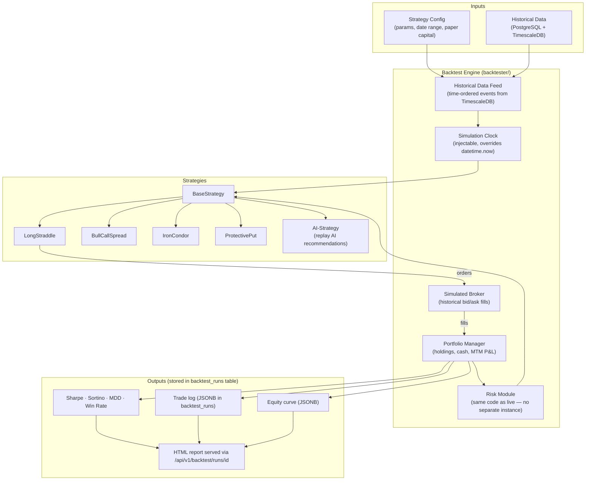

### Anti-Patterns Prevented

| Anti-Pattern | Prevention |
|-------------|------------|
| Look-ahead bias | Feed filters `t <= simulation_time` |
| Survivorship bias | Full instrument universe including expired contracts |
| Slippage ignored | Historical bid/ask from `options_chain_snapshot` |
| Overfitting | Walk-forward OOS test required before accepting strategy |
| Expiry not handled | Auto-close at NSE settlement price |
| Transaction costs ignored | STT + brokerage modeled |

---

## 15. Historical Replay Architecture

Same as backtesting engine but all live modules run against replayed data.

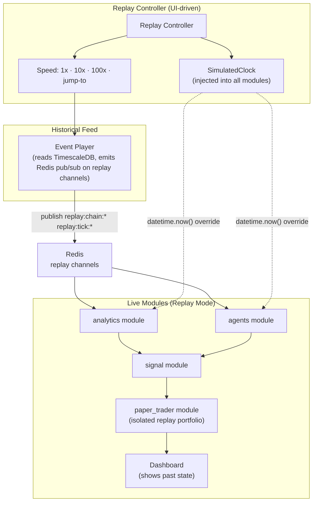

Clock injection via `app/core/clock.py` — `ClockProvider` dependency. Live mode: `datetime.now(IST)`. Replay mode: `SimulatedClock.now()`. Results stored under isolated `replay_run_id`.

---

## 16. Dashboard Architecture

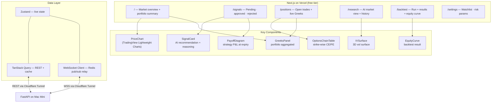

### Real-Time Updates

| Data | Mechanism | Frequency |
|------|-----------|-----------|
| Price ticks | WebSocket (Redis pub/sub relay) | On tick |
| Options chain | TanStack Query poll | 30 sec |
| Portfolio MTM P&L | WebSocket | 5 sec |
| Greeks | TanStack Query | 60 sec |
| New signals | WebSocket toast notification | On event |
| Stop-loss alerts | WebSocket modal | Immediate |

---

## 17. Monitoring

Simple setup. No Loki/Jaeger at personal scale. Prometheus + Grafana run in Docker Compose.

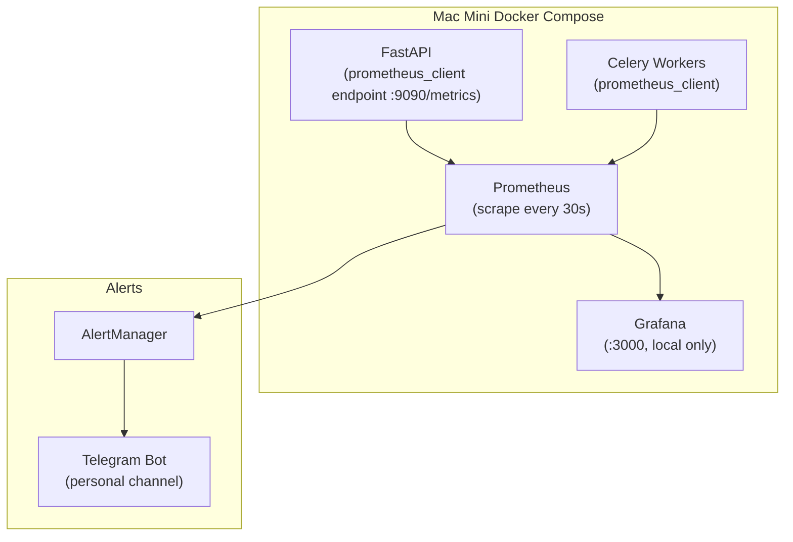

Grafana accessed via `localhost:3000` or via Cloudflare Tunnel if needed remotely.

### Key Metrics

**Market Data**
- `tick_ingest_rate` — ticks/sec
- `kite_api_latency_ms` — p50/p95
- `chain_staleness_seconds` — how old last chain fetch is

**AI Agents**
- `agent_run_duration_seconds{agent}` — per agent latency
- `llm_tokens_used_total{agent, provider}` — token tracking
- `llm_cost_usd_total{agent}` — cost tracking
- `signals_generated_total` / `signals_rejected_total`

**Portfolio**
- `open_positions_count`
- `portfolio_pnl_inr` — live gauge
- `portfolio_delta` — net delta gauge

**System**
- `redis_memory_bytes`
- `postgres_connections_active`
- `celery_queue_depth{queue}`
- Mac Mini CPU/memory via `node_exporter`

### Grafana Dashboards

1. Market Data Health — tick rate, chain freshness, Kite latency
2. AI Agent Activity — runs, tokens per model, cost trend
3. Portfolio Overview — P&L, positions, Greeks exposure
4. System Health — CPU, memory, disk, queue depth

---

## 18. Logging

Structured logging only. No Loki at personal scale — log files on disk, rotated daily.

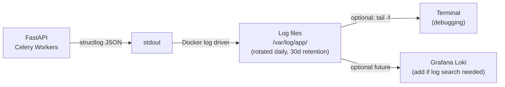

### Log Schema

```json
{
  "timestamp": "2026-06-30T09:15:00.123Z",
  "level": "info",
  "module": "agents.strategy",
  "event": "agent_run_completed",
  "agent": "strategy_agent",
  "model": "claude-sonnet-4-6",
  "run_id": "uuid",
  "duration_ms": 4521,
  "tokens_in": 8432,
  "tokens_out": 1847,
  "cost_usd": 0.078,
  "signals_generated": 3
}
```

### Log Level Policy

| Level | Events |
|-------|--------|
| ERROR | Unhandled exceptions, API auth failures, DB errors |
| WARN | Kite rate limit, signal rejected, stop-loss triggered |
| INFO | Job start/end, signal approved, trade executed, agent run |
| DEBUG | Tick processed, Greeks computed (disabled by default) |

---

## 19. Deployment Architecture

Single `docker-compose.yml`. No K8s. No CI/CD pipeline for prod — deploy manually on Mac Mini.

### docker-compose.yml Services

```yaml
# 6 containers total

postgres:
  image: timescale/timescaledb-ha:pg16
  volumes: [./data/postgres:/var/lib/postgresql/data]
  env_file: .env

redis:
  image: redis:7-alpine
  volumes: [./data/redis:/data]
  command: redis-server --appendonly yes

app:
  build: .
  command: uvicorn app.api.main:app --host 0.0.0.0 --port 8000 --workers 2
  depends_on: [postgres, redis]
  env_file: .env
  volumes: [.:/code]

celery:
  build: .
  command: celery -A tasks worker -Q market,ai,analytics,monitor,backtest --concurrency 4
  depends_on: [postgres, redis]
  env_file: .env

celery-beat:
  build: .
  command: celery -A tasks beat --scheduler celery.beat:PersistentScheduler
  depends_on: [redis]
  env_file: .env

nginx:
  image: nginx:alpine
  volumes: [./nginx/nginx.conf:/etc/nginx/nginx.conf, ./certs:/etc/nginx/certs]
  ports: ["80:80", "443:443"]
  depends_on: [app]
```

Ollama runs natively on Mac Mini (not in Docker — needs direct GPU/Metal access):

```bash
# install once
brew install ollama
ollama pull llama3.3:70b   # if 32GB+ RAM
ollama pull qwen2.5:14b    # if 16GB RAM
ollama serve               # runs on localhost:11434
```

### Cloudflare Tunnel Setup

```bash
# install once
brew install cloudflared
cloudflared tunnel login
cloudflared tunnel create options-research
cloudflared tunnel route dns options-research yourdomain.com
cloudflared tunnel run options-research   # add to launchd for autostart
```

Tunnel config (`~/.cloudflared/config.yml`):
```yaml
tunnel: <tunnel-id>
ingress:
  - hostname: yourdomain.com
    service: http://localhost:80
  - service: http_status:404
```

### Deployment Flow

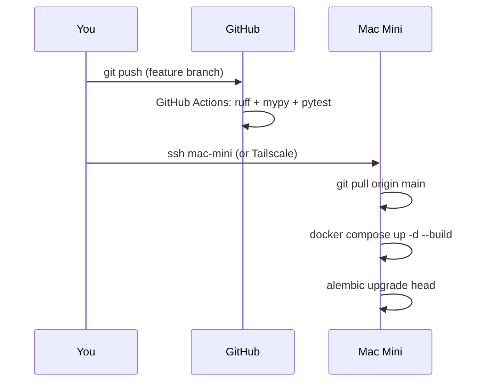

No ArgoCD. No ECR. Pull code + rebuild locally.

---

## 20. Scalability Considerations

Personal app. Scaling is not a goal. Notes for future if needed:

| If This Happens | Do This |
|----------------|---------|
| Mac Mini CPU > 80% sustained | Move backtester to EC2 spot burst |
| Need 24/7 uptime without Mac Mini | Add Oracle Free Tier as always-on host |
| 70B model too slow on 16GB | Use Groq free API instead of Ollama |
| PostgreSQL slow on backtest queries | Add TimescaleDB continuous aggregates + indexes |
| Kite WebSocket disconnects frequently | Add reconnect logic + Redis tick cache |

### Data Volume (Personal Watchlist ~30 instruments)

| Table | Rows/Year | Size/Year (compressed) |
|-------|----------|------------------------|
| OHLCV_1MIN | ~2.8M | ~30 MB |
| OPTIONS_CHAIN snapshots | ~12,500 | ~600 MB |
| SIGNALS | ~2,500 | < 1 MB |
| PAPER_TRADES | ~750 | < 1 MB |

Mac Mini 256GB SSD holds 10+ years of data comfortably.

---

## 21. Failure Recovery

Personal app. Acceptable downtime during market hours = 15-30 min max (miss some ticks, not catastrophic — paper trading only).

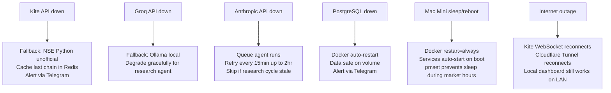

### Mac Mini Resilience

```bash
# all containers restart on reboot
restart: always  # in docker-compose.yml

# prevent Mac Mini sleep during market hours
sudo pmset -a sleep 0       # disable sleep
caffeinate -di &            # keep display + disk awake
```

### Backup

| Data | Backup | Frequency |
|------|--------|-----------|
| PostgreSQL | `pg_dump` → local external drive + Backblaze B2 (~Rs100/month) | Daily 20:00 IST |
| Redis | AOF persistence on volume | Continuous |
| .env + configs | Encrypted note (1Password/Bitwarden) | On change |
| Code | GitHub | On push |

---

## 22. Technology Stack with Justification

### Core Runtime

| Technology | Justification |
|-----------|--------------|
| Python 3.12 | Best quant/ML ecosystem; asyncio native; py_vollib, pandas, scipy |
| FastAPI | Async; auto OpenAPI docs; Pydantic; WebSocket support |
| Pydantic v2 | Fast validation; shared schemas for API + internal |
| uvicorn | ASGI server; uvloop for performance |

### AI / LLM

| Technology | Justification |
|-----------|--------------|
| Claude Sonnet 4.6 (Anthropic) | Strategy + Evaluator agents: best structured tool use, financial reasoning |
| Claude Haiku 4.5 (Anthropic) | Risk Assessment: reliable structured output, cheap |
| Llama 3.3 70B (Groq free API) | Research + Monitor: news synthesis, simple checks — free tier sufficient |
| Ollama (local Mac Mini) | Fallback for all agents during outages; 0 cost |
| pgvector | Vector similarity in existing PostgreSQL; avoids separate vector DB |
| py_vollib | Black-Scholes Greeks; Python-native; well-tested |
| scikit-learn + XGBoost | Signal feature scoring; interpretable; no GPU needed |

### Data Storage

| Technology | Justification |
|-----------|--------------|
| PostgreSQL 16 + TimescaleDB | Single DB for relational + time-series; joint queries trivial; chunk compression 90x; handles personal-scale backtesting |
| Redis 7 | Cache + pub/sub (replaces Kafka) + Celery broker + distributed locks; all in one |

### Frontend

| Technology | Justification |
|-----------|--------------|
| Next.js 15 (App Router) | SSR; file-based routing; deploys free to Vercel |
| TailwindCSS + shadcn/ui | Rapid consistent UI |
| TradingView Lightweight Charts | Free; purpose-built financial charts |
| TanStack Query | Server state + background refetch |
| Zustand | Minimal global state for WebSocket data |

### Infrastructure

| Technology | Justification |
|-----------|--------------|
| Mac Mini (Apple Silicon) | Already owned; runs all services + Ollama 70B efficiently |
| Docker Compose | Single command startup; no K8s complexity |
| nginx | SSL termination + reverse proxy; free |
| Cloudflare Tunnel | Remote access without port forwarding; free; TLS automatic |
| Vercel | Next.js hosting; free tier; global CDN |
| Let's Encrypt | Free TLS via Certbot |

### Background Processing

| Technology | Justification |
|-----------|--------------|
| Celery + Redis | Mature; beat scheduler; retry with backoff; multiple priority queues |
| APScheduler | In-process market-hours-aware scheduling; IST timezone |
| tenacity | Circuit breaker + retry for Kite, Groq, Anthropic APIs |

---

## Architecture Decision Records

### ADR-001: True Monolith (No Microservices)

**Status:** Accepted
**Decision:** Single FastAPI process. Modules are Python packages, not services.
**Reason:** Personal app, one user, one Mac Mini. Microservices = overhead with zero benefit. Direct function calls are faster, simpler, easier to debug.

### ADR-002: Redis Pub/Sub over Kafka

**Status:** Accepted
**Decision:** Redis pub/sub for all internal events.
**Reason:** Kafka requires 3 brokers minimum for durability, costs $460/month on MSK. Personal-scale event volume (tens/day, not millions) fits Redis trivially. No replay needed — DB is source of truth, events are triggers only.

### ADR-003: TimescaleDB over ClickHouse

**Status:** Accepted
**Decision:** TimescaleDB handles all time-series including backtesting.
**Reason:** Personal watchlist = ~2.8M OHLCV rows/year. TimescaleDB with chunk compression = ~30MB/year. ClickHouse unnecessary. Eliminates separate EC2 instance ($121/month saved).

### ADR-004: LLM Model Split (Claude + Groq + Ollama)

**Status:** Accepted
**Decision:** Claude Sonnet for strategy + evaluation (quality-critical), Claude Haiku for risk (reliability needed), Groq free for research + monitor, Ollama as universal fallback.
**Reason:** Claude quality is genuinely better for multi-leg options strategy reasoning. But research synthesis and position monitoring don't need it. Split optimizes cost (~Rs500/month) while keeping quality where it matters.

### ADR-005: Mac Mini over Cloud VPS

**Status:** Accepted
**Decision:** Run all infrastructure on owned Mac Mini.
**Reason:** Already owned = $0 compute. Apple Silicon runs Ollama 70B at ~35 tok/s via Metal. 5ms latency to Kite WebSocket (vs 150ms from Hetzner, 80ms from AWS Mumbai). Electricity ~Rs200/month vs Rs1,700-6,500/month VPS.

### ADR-006: Read-Only Broker Integration (No Live Trading)

**Status:** Firm Constraint
**Decision:** Kite Connect for market data only. No order placement.
**Reason:** SEBI algo-trading registration required for automated orders. Platform is research + paper trading only.

---

## Monthly Cost Summary

| Item | Cost |
|------|------|
| Mac Mini compute | Rs0 (owned) |
| PostgreSQL + Redis + nginx (Docker) | Rs0 |
| Ollama LLM (local) | Rs0 |
| Groq API (Llama 3.3 70B) | Rs0 (free tier) |
| Claude Sonnet 4.6 (strategy + eval) | ~Rs460 |
| Claude Haiku 4.5 (risk assessment) | ~Rs55 |
| Kite Connect live data | Rs2,000 |
| Cloudflare Tunnel | Rs0 |
| Vercel (Next.js) | Rs0 |
| Backblaze B2 backup | ~Rs100 |
| Electricity (Mac Mini ~20W avg) | ~Rs200 |
| Domain | ~Rs85 |
| **Total** | **~Rs2,900/month (~$35)** |

---

## Appendix: Indian Market Specifics

### NSE F&O Scope

- **Index options:** Nifty 50, Bank Nifty, Nifty Financial Services, Midcap Select
- **Stock options:** ~200 NSE-listed F&O securities (research subset: 20-30 on watchlist)
- **Weekly expiry:** Thursday (index options)
- **Monthly expiry:** Last Thursday of month
- **Lot sizes:** Nifty = 50, Bank Nifty = 15 (stored in `constants.py`)
- **Strike intervals:** Index Rs50/Rs100; Stock 2.5-5% of price
- **Market hours:** 09:15-15:30 IST, Mon-Fri, NSE holidays excluded

### Regulatory Constraints

| Rule | Enforcement |
|------|-------------|
| No live order placement | Paper Trader only; Kite API read-only |
| SEBI F&O position limits | Risk Manager Layer 1 check |
| No after-hours trading simulation | Market-hours scheduler blocks paper trades outside 09:15-15:30 |
| STT + transaction costs | Modeled in backtester broker simulation |

### NSE Holiday Calendar

- NSE publishes annual CSV
- `scripts/market_calendar.py` syncs to `market_holidays` DB table
- All schedulers call `calendar.market_open()` before running market-hours jobs
